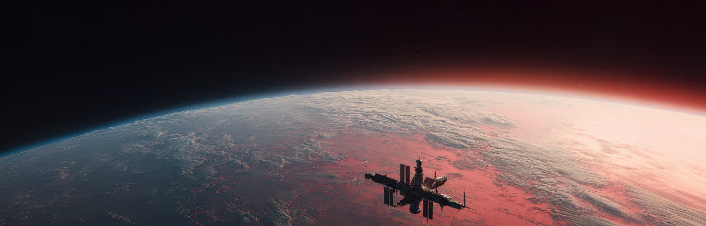

  <!-- BANNER -->
  
  

    Image by 
      <a href="https://futurescapesuniverse.com/">Futurescapes</a>
    
  

  

  <!-- DESCRIPCIÓN -->
  

    <strong>Ingenieria, diseño y optimización de sistemas complejos con impacto medible.</strong> 
    Sistemas IoT y visión artificial aplicados a procesamiento y visualización de datos en tiempo real.
  

  <!-- CONTACTO / REDES -->
  
  
  
  

  

 

<!-- SECCIÓN SOBRE MI Y QUE ESTOY HACIENDO -->
## Sobre mi y que hago actualmente

- 🔭 **Trabajando en diversos proyectos personales, y dedicandole horas al más importante [3DIndustry](https://3dindustry.vercel.app/)**
- 🌱 **Sumando a mi Stack nuevas herramientas como Claude Code y Obsidian y sigo fortaleciendo áreas de conocimiento que implican el desarrollo de soluciones con IoT e Inteligencia Artificial**
- 💼 **+4 años trabajando en la digitalización de procesos y volviendo realidad proyectos elaborando prototipos funcionales**
- 🌍 <strong>La Plata, Buenos Aires, Argentina</strong> <a href="https://www.google.com/maps?q=-34.92145,-57.95453">📌</a>
- 💬 **Tomemos un café ☕**

<!-- SECCIÓN STACK TECONOLÓGICO -->
## Stack de herramientas tecnológicas

%20│%2010%20(experto)-3498db?style=flat-square&logo=simpleanalytics)

**Languages**

**Frameworks & Libraries**

**AI / ML & Computer Vision**

**Embedded & IoT**

**Databases & Cloud**

**Tools & Productivity**

**Hobby Tools**

<!--
## Proyectos
### [Nombre del Proyecto](https://github.com/[tu-username]/[repo])
> [Aca podemos escribir de lo que trata el proyecto.]

- **Tecnologías:** `[tecnología 1]` · `[tecnología 2]` · `[tecnología 3]`
- **Highlights:** [logros medibles, e.g. "se redujo el costo operacional un 40%", "adoptado por X cantidad de usarios", "tiempos de fabricacion reducidos un X%. "Numeros de accidentes disminuidos un 20%"]
-->

<!--
## Estadisticas generales

### Lenguajes

 -->

---

  <h4><i>Buscando oportunidades para trabajar en grandes proyectos — Contáctate</i></h4>

---

<!-- Footer -->
  

Image by <a href="https://futurescapesuniverse.com/">Futurescapes</a>
